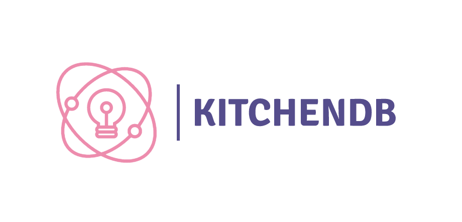

# kitchendb 

## Design goals

- support postgresql wire protocol
- support for both OLTP and OLAP(i.e HTAP) workloads
- sql compatible query language
- pluggable storage engine
- acid transactions
- replicate data across multiple nodes to provide HA

Check out [design doc](./docs/design.md) for more deatils

### why?

- to understand and implement internals of a dbms 

### Todos

- [x] write first draft of design doc
- [x] setup ci
- [x] import [vitess-sqlparser](https://github.com/blastrain/vitess-sqlparser)
- [ ] storage engine
- [ ] telemetry framework
- [ ] finish the design doc of transactional layer
- [ ] setup [yahoo cloud service benchmark](https://github.com/brianfrankcooper/YCSB)

### development

- install go(>= 1.15) and `make`
- run `make`
- run `make test`

### contribution

- head over to [issues](https://github.com/devenbhooshan/kitchendb/issues) and start contributing
